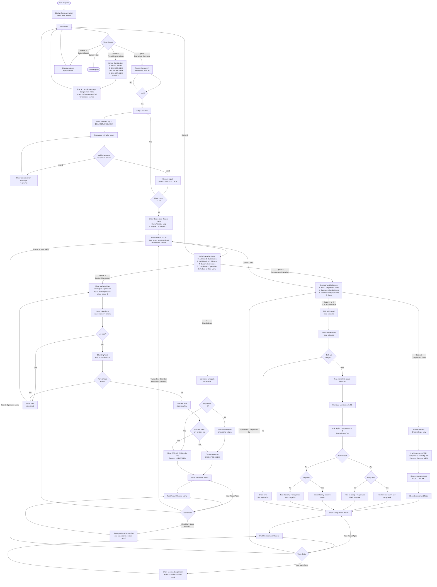

# Activity No. 1 — Number System Converter and Arithmetic Calculator

## System Requirements, Algorithm / Pseudocode, and Flowchart

---

## 1. Project Overview

The **Number System Converter and Arithmetic Calculator** is a console-based software system developed in standard **C++ (C++11)**. It converts multiple numbers across four numeral systems and evaluates mixed-base arithmetic expressions with full operator precedence support.

| Base | Name        | Valid Characters |
| ---- | ----------- | ---------------- |
| 2    | Binary      | `0`, `1`         |
| 8    | Octal       | `0`–`7`          |
| 10   | Decimal     | `0`–`9`          |
| 16   | Hexadecimal | `0`–`9`, `A`–`F` |

Radix-point fractions (e.g. `101.101`, `1A.F`) are supported for conversion in all bases.

---

## 2. System Requirements

### 2.1 Functional Requirements

| #     | Requirement                             | Description                                                                                                                                                         |
| ----- | --------------------------------------- | ------------------------------------------------------------------------------------------------------------------------------------------------------------------- |
| FR-01 | **Multi-Input Acceptance**              | Prompts user for count N >= 3 (validated, max 20).                                                                                                                  |
| FR-02 | **Independent Base Selection**          | Each input independently assigns one of: Binary, Octal, Decimal, Hexadecimal.                                                                                       |
| FR-03 | **Strict Character Validation**         | Every character is validated against the chosen base; invalid chars produce a descriptive error and re-prompt without crashing.                                     |
| FR-04 | **Radix Fraction Support**              | Accepts and correctly converts numbers with a single radix point (e.g. `10.11` BIN = `2.75` DEC).                                                                   |
| FR-05 | **4-Base Simultaneous Conversion**      | Each input is converted to Binary, Octal, Decimal, and Hexadecimal in one step.                                                                                     |
| FR-06 | **Formatted Table Output**              | Conversion results displayed in a centered, color-coded ASCII table.                                                                                                |
| FR-07 | **Step-by-Step Math Proof**             | User can inspect positional-notation expansion (N->10) and successive-division/multiplication (10->M) for any input.                                                |
| FR-08 | **Standard Arithmetic Operations**      | Addition, Subtraction, Multiplication, Division applied across all N inputs; result displayed in all 4 bases.                                                       |
| FR-09 | **Custom Expression Evaluator**         | User types any infix expression using variables `a`-`z` (mapped to inputs 1-N) and operators `+ - * /` with parentheses.                                            |
| FR-10 | **Operator Precedence & Associativity** | `*` and `/` bind tighter than `+` and `-`; all operators are left-associative; parentheses override precedence.                                                     |
| FR-11 | **Implicit Multiplication**             | Adjacent terms without an explicit operator (e.g. `a(b+c)`, `(a+b)c`) automatically insert `*`.                                                                     |
| FR-12 | **Division-by-Zero Protection**         | Detects and reports division-by-zero for both simple and custom expression modes; result fields show `UNDEFINED`.                                                   |
| FR-13 | **Try Another Operation (Back)**        | After viewing a result, user returns to the operation selector and tries a different operation without re-entering numbers.                                         |
| FR-14 | **Preset Test Suite**                   | 4 built-in number combinations (BIN+OCT+DEC, BIN+DEC+HEX, OCT+DEC+HEX, BIN+OCT+HEX); each runs all 4 arithmetic operations and complement operations automatically. |
| FR-15 | **Keyboard Navigation**                 | Scrollable menus with Arrow keys or W/S, confirmed with Enter or Space.                                                                                             |
| FR-16 | **1's Complement (Diminished Radix)**   | For any integer input, computes the 1's complement (flip all bits for binary; `(r^n - 1) - X` generalized) displayed in all 4 bases.                                |
| FR-17 | **2's Complement (Radix Complement)**   | Computes the 2's complement (`1's complement + 1`) for any integer input, shown in all 4 bases.                                                                     |
| FR-18 | **Complement Table View**               | Displays a combined 1's & 2's complement table for all entered inputs, with bit-width, padded binary, and all-bases conversion.                                     |
| FR-19 | **Subtraction via 1's Complement**      | Performs `A − B` (Input 1 − Input 2) using the end-around carry method; shows every step and result in all 4 bases.                                                 |
| FR-20 | **Subtraction via 2's Complement**      | Performs `A − B` (Input 1 − Input 2) using the discard-carry method; shows every step and result in all 4 bases.                                                    |

### 2.2 Non-Functional Requirements

| #      | Requirement                                                                                                                                                                       |
| ------ | --------------------------------------------------------------------------------------------------------------------------------------------------------------------------------- |
| NFR-01 | Language: Standard **C++11** — compatible with Dev-C++ MinGW GCC 4.9, Code::Blocks, Visual Studio, GCC.                                                                           |
| NFR-02 | Zero external dependencies — only standard headers: `<iostream>`, `<string>`, `<vector>`, `<cmath>`, `<sstream>`, `<iomanip>`, `<cctype>`, `<algorithm>`, `<chrono>`, `<thread>`. |
| NFR-03 | ANSI color codes used for color output on Windows Terminal and compatible consoles.                                                                                               |
| NFR-04 | Robust input handling — no crashes or infinite loops on any user input.                                                                                                           |
| NFR-05 | Centered, formatted UI at configurable terminal width (default 92 columns).                                                                                                       |

---

## 3. Algorithms and Pseudocode

### 3.1 Algorithm 1: Input Validation

```
Algorithm: Validate_Input(input_str, base)
Input:  input_str (string), base in {2, 8, 10, 16}
Output: isValid (bool), errorMsg (string)

1.  IF input_str is empty:
        errorMsg = "Input cannot be empty."
        Return FALSE

2.  dotCount <- 0

3.  FOR EACH character c IN input_str:
        IF c == '.':
            dotCount <- dotCount + 1
            IF dotCount > 1:
                errorMsg = "Multiple radix points not allowed."
                Return FALSE
            CONTINUE
        upper_c   <- ToUpper(c)
        digit_val <- Position of upper_c in "0123456789ABCDEF"
        IF digit_val == NOT_FOUND OR digit_val >= base:
            errorMsg = "Invalid character '" + c + "' for " + BaseName(base)
            Return FALSE

4.  IF input_str == ".":
        errorMsg = "Cannot be just a decimal point."
        Return FALSE

5.  Return TRUE
```

---

### 3.2 Algorithm 2: Base-N to Decimal Conversion (N -> 10)

```
Algorithm: To_Decimal(input_str, base)
Input:  input_str (string), base (integer)
Output: decimal_value (double)

1.  Split input_str at '.' -> integer_part, fractional_part
2.  IF integer_part is empty -> set integer_part = "0"
3.  decimal_value <- 0.0
4.  int_len <- length(integer_part)

    // Integer part: positional expansion
5.  FOR i FROM 0 TO int_len - 1:
        digit         <- Char_To_Digit(integer_part[i])
        power         <- int_len - 1 - i
        decimal_value <- decimal_value + digit * (base ^ power)

    // Fractional part: positional expansion
6.  FOR j FROM 0 TO length(fractional_part) - 1:
        digit         <- Char_To_Digit(fractional_part[j])
        power         <- -(j + 1)
        decimal_value <- decimal_value + digit * (base ^ power)

7.  Return decimal_value
```

---

### 3.3 Algorithm 3: Decimal to Base-M Conversion (10 -> M)

```
Algorithm: From_Decimal(decimal_value, target_base, max_frac = 6)
Input:  decimal_value (double), target_base (int), max_frac (int)
Output: result_str (string)

1.  IF decimal_value == 0 -> Return "0"
2.  is_negative <- (decimal_value < 0)
3.  abs_val   <- absolute value of decimal_value
4.  int_part  <- FLOOR(abs_val)
5.  frac_part <- abs_val - int_part
6.  int_str   <- ""

    // Integer part: successive division
7.  IF int_part == 0:
        int_str = "0"
    ELSE:
        temp <- int_part
        WHILE temp > 0:
            rem     <- temp MOD target_base
            int_str <- DIGITS[rem] + int_str   // prepend digit
            temp    <- FLOOR(temp / target_base)

    // Fractional part: successive multiplication
8.  frac_str <- ""
9.  IF frac_part > 0:
        temp_frac <- frac_part
        count <- 0
        WHILE temp_frac > 0 AND count < max_frac:
            temp_frac <- temp_frac * target_base
            digit     <- FLOOR(temp_frac)
            frac_str  <- frac_str + DIGITS[digit]
            temp_frac <- temp_frac - digit
            count     <- count + 1

10. IF is_negative -> int_str = "-" + int_str
11. IF frac_str != "" -> Return int_str + "." + frac_str
12. Return int_str
```

---

### 3.4 Algorithm 4: Standard Arithmetic Operation

```
Algorithm: Process_Arithmetic(numbers[], operation)
Input:  numbers[] (list of InputNumber), operation in {ADD, SUB, MUL, DIV}
Output: ArithmeticResult (expression string, decimal result, BIN/OCT/DEC/HEX)

1.  Build original expression string:
        FOR EACH number[i]:
            expression <- expression + number[i].originalStr + " [" + BaseCode(i) + "]"
            IF not last -> append " <op_symbol> "

2.  CASE operation:
        ADD: result <- 0
             FOR EACH n: result <- result + n.decimalValue
        SUB: result <- numbers[0].decimalValue
             FOR i FROM 1 TO N-1: result <- result - numbers[i].decimalValue
        MUL: result <- 1
             FOR EACH n: result <- result * n.decimalValue
        DIV: result <- numbers[0].decimalValue
             FOR i FROM 1 TO N-1:
                 IF numbers[i].decimalValue == 0:
                     isValid  <- FALSE
                     errorMsg <- "Division by zero is not allowed."
                     STOP
                 result <- result / numbers[i].decimalValue

3.  IF isValid:
        binStr <- From_Decimal(result, 2)
        octStr <- From_Decimal(result, 8)
        decStr <- Format(result)
        hexStr <- From_Decimal(result, 16)
    ELSE:
        binStr = octStr = decStr = hexStr = "UNDEFINED"

4.  Build decimal expression:  decExpr = "X1 op X2 op ... = result"
5.  Return ArithmeticResult
```

---

### 3.6 Algorithm 6: 1's & 2's Complement Computation

```
Algorithm: Compute_Complements(num)
Input:  num (InputNumber with integer binary representation)
Output: ComplementResult (bitWidth, paddedBin, onesComp_*, twosComp_*)

1. IF num has a radix-point fraction:
       Note = "Fractional numbers — complement not applicable."
       Return (applicable = FALSE)

2. rawBin      <- num.binStr  (integer binary, no '.' )
3. reqBits     <- length(rawBin)
4. bitWidth    <- smallest multiple of 8  that is >= reqBits  (min 8)
5. paddedBin   <- LeftPad(rawBin, bitWidth, '0')

6. onesComp_bin <- FlipAllBits(paddedBin)
       // Each '0' -> '1', each '1' -> '0'
7. onesDecVal   <- To_Decimal(onesComp_bin, 2)
8. Convert onesDecVal -> OCT, DEC, HEX

9. twosComp_bin <- AddOne(onesComp_bin)  // carry wraps within bitWidth
10. twosDecVal  <- To_Decimal(twosComp_bin, 2)
11. Convert twosDecVal -> OCT, DEC, HEX

12. Return ComplementResult
```

---

### 3.7 Algorithm 7: Subtraction by Complement Method

```
Algorithm: Complement_Subtract(A, B, useTwos)
Input:  A, B (InputNumber — integers only), useTwos (bool)
Output: CompSubResult (step data, final result in BIN/OCT/DEC/HEX)

1. IF A or B have fractional parts:
       errorMsg = "Complement subtraction requires integer inputs."
       Return (isValid = FALSE)

2. rawA <- A.binStr,  rawB <- B.binStr
3. reqBits  <- max(length(rawA), length(rawB))
4. bitWidth <- smallest multiple of 8 >= reqBits  (min 8)
5. A_bin <- LeftPad(rawA, bitWidth, '0')
6. B_bin <- LeftPad(rawB, bitWidth, '0')

   // Step 1: compute complement of B
7. IF useTwos:
       comp_bin <- TwosComplement(B_bin)   // flip + add 1
   ELSE:
       comp_bin <- OnesComplement(B_bin)   // flip all bits

   // Step 2: binary addition
8. (sum_bin, carryOut) <- BinaryAdd(A_bin, comp_bin)

   // Step 3: carry adjustment
9. IF useTwos:
       adjusted_bin <- sum_bin         // discard carryOut
       isNegative   <- (carryOut == FALSE)
   ELSE:
       IF carryOut:
           adjusted_bin <- BinaryAdd(sum_bin, "1")  // end-around carry
           isNegative   <- FALSE
       ELSE:
           adjusted_bin <- OnesComplement(sum_bin)  // get magnitude
           isNegative   <- TRUE

10. mag <- To_Decimal(adjusted_bin, 2)
11. decimalResult <- isNegative ? -mag : mag
12. Convert decimalResult -> BIN, OCT, DEC, HEX
13. Return CompSubResult
```

---

### 3.5 Algorithm 5: Custom Expression Evaluator (Shunting-Yard)

Parses and evaluates any infix expression such as `(a+b)*c-d` where variables
`a`–`z` map to inputs 1–N in order.

#### Step A — Lexer with Implicit Multiplication Pass

```
Algorithm: Tokenize_Expression(expr_str, num_vars)
Input:  expr_str (string), num_vars (int)
Output: tokens[] (Token list), errorMsg (string)

Token kinds: TOK_VAR, TOK_OP, TOK_LPAREN, TOK_RPAREN, TOK_END

1.  raw_tokens <- []
2.  FOR EACH character c IN expr_str:
        SKIP whitespace
        IF c == '(' -> push TOK_LPAREN
        IF c == ')' -> push TOK_RPAREN
        IF c in {'+', '-', '*', '/'} -> push TOK_OP(c)
        IF c is a letter:
            idx <- lowercase(c) - 'a'
            IF idx >= num_vars:
                errorMsg = "Variable '" + c + "' out of range."
                Return []
            push TOK_VAR(idx)
        ELSE:
            errorMsg = "Invalid character '" + c + "'"
            Return []
3.  push TOK_END

    // Implicit multiplication pass
    // Insert '*' between adjacent tokens that imply multiplication:
4.  expanded <- []
5.  FOR j FROM 0 TO length(raw_tokens) - 1:
        expanded.push(raw_tokens[j])
        IF j + 1 < length(raw_tokens):
            cur  <- raw_tokens[j].kind
            next <- raw_tokens[j+1].kind
            needMul =  (cur == VAR    AND next == LPAREN)   // a(b+c)
                    OR (cur == RPAREN AND next == VAR)       // (a+b)c
                    OR (cur == RPAREN AND next == LPAREN)    // (a+b)(c+d)
                    OR (cur == VAR    AND next == VAR)       // ab
            IF needMul:
                expanded.push(TOK_OP('*'))
6.  Return expanded
```

#### Step B — Shunting-Yard: Infix to Postfix (RPN)

```
Algorithm: Infix_To_Postfix(tokens[])
Input:  tokens[] (from lexer)
Output: postfix[] (RPN token list), errorMsg (string)

Precedence:  '*' = '/' = 2 (high),  '+' = '-' = 1 (low)
Associativity: all left-associative

1.  output_queue <- [],  op_stack <- []
2.  FOR EACH token t IN tokens[]:
        IF t.kind == TOK_END -> BREAK
        IF t is VAR:
            output_queue.enqueue(t)
        IF t is OP:
            WHILE op_stack not empty
                  AND top(op_stack) is OP
                  AND precedence(top) >= precedence(t):
                output_queue.enqueue(op_stack.pop())
            op_stack.push(t)
        IF t is LPAREN:
            op_stack.push(t)
        IF t is RPAREN:
            WHILE op_stack not empty AND top(op_stack) != LPAREN:
                output_queue.enqueue(op_stack.pop())
            IF op_stack is empty:
                errorMsg = "Mismatched parentheses: extra ')' detected."
                Return []
            op_stack.pop()   // discard the matching LPAREN

3.  WHILE op_stack not empty:
        IF top(op_stack) is LPAREN:
            errorMsg = "Mismatched parentheses: unclosed '(' detected."
            Return []
        output_queue.enqueue(op_stack.pop())

4.  Return output_queue
```

#### Step C — RPN Stack Evaluator

```
Algorithm: Evaluate_Postfix(postfix[], numbers[])
Input:  postfix[] (RPN token list), numbers[] (InputNumber list)
Output: result (double), errorMsg (string)

1.  value_stack <- []
2.  FOR EACH token t IN postfix[]:
        IF t is VAR:
            value_stack.push(numbers[t.varIdx].decimalValue)
        IF t is OP:
            IF size(value_stack) < 2:
                errorMsg = "Not enough operands for operator '" + t.op + "'"
                Return error
            b <- value_stack.pop()
            a <- value_stack.pop()
            CASE t.op:
                '+': value_stack.push(a + b)
                '-': value_stack.push(a - b)
                '*': value_stack.push(a * b)
                '/': IF b == 0:
                         errorMsg = "Division by zero: divisor evaluates to 0."
                         Return error
                     value_stack.push(a / b)

3.  IF size(value_stack) != 1:
        errorMsg = "Malformed expression."
        Return error
4.  Return value_stack.top()
```

---

## 4. System Flowchart



---

## 5. Implementation Details

### 5.1 Key Data Structures

```cpp
struct InputNumber {
    string originalStr;                    // value as entered by user
    int    base;                           // 2, 8, 10, or 16
    double decimalValue;                   // intermediate decimal
    string binStr, octStr, decStr, hexStr; // converted forms
    bool   isValid;
};

struct ArithmeticResult {
    string operationName;                  // e.g. "Addition"
    string operationSymbol;               // e.g. "+"
    string expression;                    // e.g. "101010 [BIN] + 52 [OCT]"
    string decimalExpr;                   // e.g. "42 + 42 = 84"
    double decimalValue;
    string binStr, octStr, decStr, hexStr;
    bool   isValid;
    string errorMsg;
};

struct CustomExprResult {
    string originalExpr;    // as typed:          (a+b)*c
    string substitutedExpr; // values with labels: (101010[BIN]+52[OCT])*42[DEC]
    string decimalExpr;     // decimal form:       (42+42)*42 = 3528
    double decimalValue;
    string binStr, octStr, decStr, hexStr;
    bool   isValid;
    string errorMsg;
};
```

### 5.2 Arithmetic Formulas

| Operation      | Formula                                              |
| -------------- | ---------------------------------------------------- |
| Addition       | R = X1 + X2 + ... + XN                               |
| Subtraction    | R = X1 - X2 - ... - XN                               |
| Multiplication | R = X1 x X2 x ... x XN                               |
| Division       | R = X1 / X2 / ... / XN                               |
| 1's Complement | `~X` (flip all bits), generalized as `(r^n - 1) - X` |
| 2's Complement | `~X + 1` (1's complement plus 1)                     |
| Sub (1's comp) | `A + ones_comp(B)`; add carry-out back (end-around)  |
| Sub (2's comp) | `A + twos_comp(B)`; discard carry-out                |

### 5.3 Operator Precedence Table

| Operator       | Symbol | Precedence | Associativity |
| -------------- | ------ | ---------- | ------------- |
| Multiplication | `*`    | 2 — High   | Left          |
| Division       | `/`    | 2 — High   | Left          |
| Addition       | `+`    | 1 — Low    | Left          |
| Subtraction    | `-`    | 1 — Low    | Left          |
| Parentheses    | `( )`  | Highest    | Overrides all |

### 5.4 Variable Mapping (Custom Expression Mode)

| Variable | Maps to            |
| -------- | ------------------ |
| `a`      | Input 1            |
| `b`      | Input 2            |
| `c`      | Input 3            |
| `d`      | Input 4            |
| ...      | ... up to Input 20 |

**Implicit multiplication** — automatically inserted between adjacent terms:

| You type     | System interprets as |
| ------------ | -------------------- |
| `a(b+c)`     | `a * (b+c)`          |
| `(a+b)c`     | `(a+b) * c`          |
| `(a+b)(c+d)` | `(a+b) * (c+d)`      |
| `ab`         | `a * b`              |

### 5.5 Error Handling Summary

| Error Condition                 | Detection Point         | Message Shown                                             |
| ------------------------------- | ----------------------- | --------------------------------------------------------- |
| Invalid char in number input    | Lexer (validateInput)   | "Invalid character 'X' for Base N"                        |
| Multiple radix points           | Lexer (validateInput)   | "Multiple radix points not allowed"                       |
| Division by zero (simple mode)  | processArithmetic       | "Division by zero is not allowed."                        |
| Division by zero (custom mode)  | evalPostfix             | "Division by zero: divisor evaluates to 0."               |
| Variable out of range           | tokenizeExpr            | "Variable 'X' out of range. Only N inputs defined."       |
| Invalid character in expression | tokenizeExpr            | "Invalid character 'X' in expression."                    |
| Unclosed parenthesis            | infixToPostfix          | "Mismatched parentheses: unclosed '(' detected."          |
| Extra closing parenthesis       | infixToPostfix          | "Mismatched parentheses: extra ')' detected."             |
| Malformed expression            | evalPostfix             | "Malformed expression: too many values left unevaluated." |
| Empty expression                | processCustomExpression | "Expression cannot be empty."                             |
